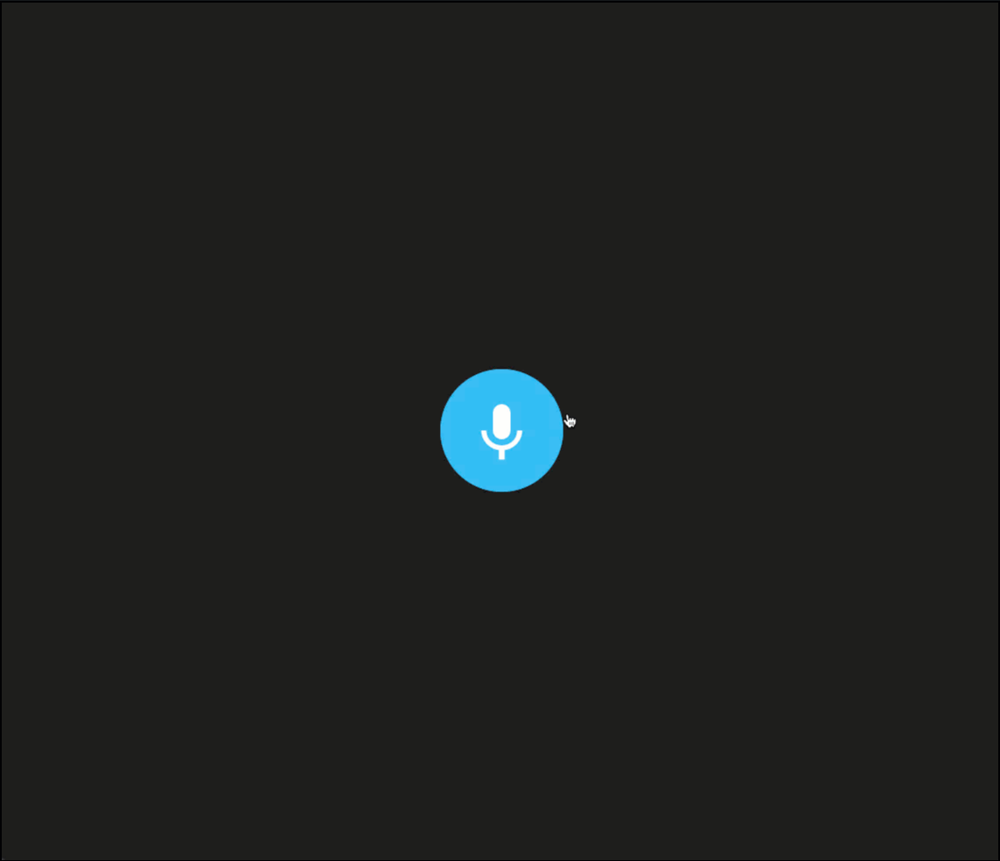

# Memo Voice App Using HTML5, Media Recorder and getUserMedia Web APIs

- Let your star (🌟 ) on this repository and clone it on your personal machine.

---

- On [preclass](./preclass) you're gonna find my pre-recorded demo.

- On [recorded](./recorded) you're gonna find the demo built in class.

## Running

- npm ci && npm start

## Demo

- When you click start recording it'll record your voice and then play it .

## Credits

- Layout got from [Ettrics' CodePen](https://codepen.io/ettrics/pen/KpzzQZ)